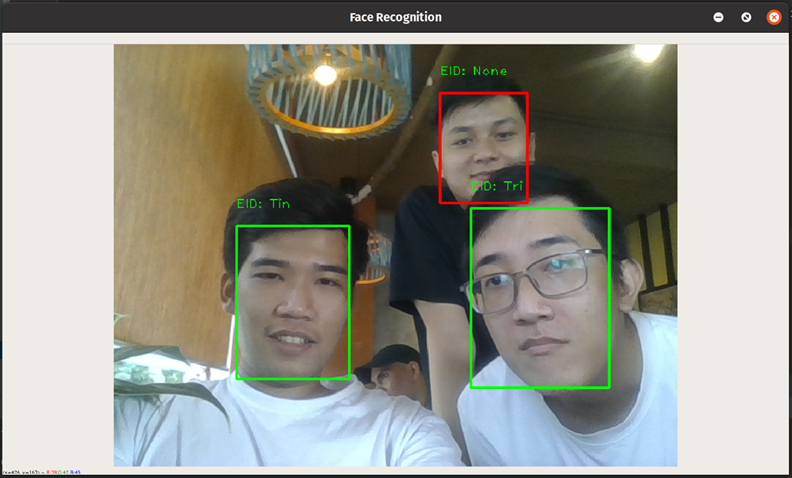

# Face Recognition

Face Recognization is a personal project, which applies RetinaFace to detect faces. 
After that, I'm using the Insight Face model to create embedding from faces that have been split before.

In the register section, all embedding vectors will be normalized and store in the pool.

With the recognization section, faces detected will also normalized.
The dot product of it with the pool above, which was used to find the nearest face.


### Pre-requirement
1. Refer using GPU device to get best performance.
2. Install `requirement.txt` package list.
3. Make system can record all your angle face during register step like iPhone.

### To register

`python3 register.py`

```python
from argparse import ArgumentParser

args = ArgumentParser()
args.add_argument('-c', '--camera_url', default=0, type=str, help='0 - local camera')
args.add_argument('-dt', '--detect_threshold', default=0.975, type=float, help="Threshold of face detection")
args.add_argument('-rf', '--register_threshold', default=0.8, type=float, help="Threshold of face recognition")
args.add_argument('--device', default='cuda:0', type=str, help="Device run model. `cuda:<id>` or `cpu`")
args.add_argument('--detect_face_model', default='data/pretrained/mobilenet_header.pth',
                  type=str, help="Face detector model path")
args.add_argument('--detect_face_backbone', default='data/pretrained/mobile_backbone.tar',
                  type=str, help="Face detector backbone path")
args.add_argument('--recognized_model', default='data/pretrained/embedder_resnet50_asia.pth'
                  , type=str, help="Face embedding model path")
args.add_argument('--model_registered', default='model_faces.npy', type=str, help="Model contain face's vectors")
args.add_argument('--model_ids', default='model_face_ids.npy', type=str, help="Model contain face's ids")
args.add_argument('--register_name', required=True, type=str, help="(Required) Register's name!")
```

Note: `camera_url` (integer) - mean select camera device id.

`model_faces.npy` and `model_face_ids.npy` will be created, which store all vectors and vector's id.

### To recognize
    python3 recognize.py
    -h to get help
    
```python
from argparse import ArgumentParser

args = ArgumentParser()
args.add_argument('-c', '--camera_url', default=0, type=str, help='0 - local camera')
args.add_argument('-dt', '--detect_threshold', default=0.975, type=float, help="Threshold of face detection")
args.add_argument('-rf', '--recognized_threshold', default=0.8, type=float, help="Threshold of face recognition")
args.add_argument('--device', default='cuda:0', type=str, help="Device run model. `cuda:<id>` or `cpu`")
args.add_argument('--detect_face_model', default='data/pretrained/mobilenet_header.pth',
                  type=str, help="Face detector model path")
args.add_argument('--detect_face_backbone', default='data/pretrained/mobile_backbone.tar',
                  type=str, help="Face detector backbone path")
args.add_argument('--recognized_model', default='data/pretrained/embedder_resnet50_asia.pth'
                  , type=str, help="Face embedding model path")
args.add_argument('--model_registered', default='model_faces.npy', type=str, help="Model contain face's vectors")
args.add_argument('--model_ids', default='model_face_ids.npy', type=str, help="Model contain face's ids")
args = args.parse_args()
```

Try it. :)
Have fun.

### Test


### References

1. Jiankang Deng, Jia Guo, Niannan Xue (2019), ArcFace: Additive Angular Margin Loss for Deep Face Recognition - https://arxiv.org/pdf/1801.07698.pdf
2. Jiankang Deng, Jia Guo, Yuxiang Zhou, Jinke Yu, Irene Kotsia, Stefanos Zafeiriou (2019), RetinaFace: Single-stage Dense Face Localisation in the Wild - https://arxiv.org/pdf/1905.00641.pdf?fbclid=IwAR3yk-dQamoT-AD0YiK8HSOsxJruNdAz0vWjJlYSoS63p16TDb01UjB5F7U
3. Yang Li, FACE RECOGNITION SYSTEM - https://arxiv.org/ftp/arxiv/papers/1901/1901.02452.pdf
4. LAVENDER, Deep Learning và bài toán nhận dạng khuôn mặt - https://techblog.vn/deep-learning-va-bai-toan-nhan-dang-khuon-mat
5. cs231n, Convolutional Neural Networks (CNNs / ConvNets) - https://cs231n.github.io/convolutional-networks/
6. Jay Wang, Robert Turko, Omar Shaikh, Haekyu Park, Nilaksh Das, Fred Hohman, Minsuk Kahng, and Polo Chau, CNN Explainer - https://poloclub.github.io/cnn-explainer/
7. Volodymyr Kovenko (2019), How to precisely align face in Python with OpenCv and Dlib - https://towardsdatascience.com/precise-face-alignment-with-opencv-dlib-e6c8acead262
